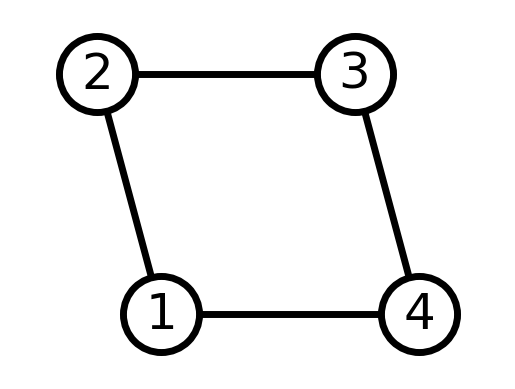
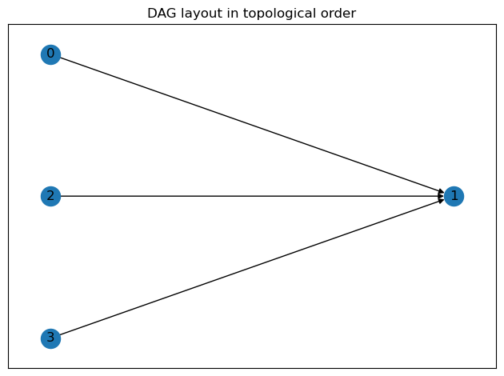

# Graph

## 1.1 Undirected graph
$$
\begin{array}{l}
V = \{1,2,3,4\} \\
E = \{ \{ 1, 2 \}, \{ 2, 3 \}, \{ 3, 4 \}, \{ 4, 1 \} \} \\
G = (V, E)
\end{array}
$$

where $\{ a, b \} = \{ b, a \}$


```python
import networkx as nx
import matplotlib.pyplot as plt

G = nx.Graph()
G.add_edge(1, 2)
G.add_edge(2, 3)
G.add_edge(3, 4)
G.add_edge(4, 1)

# explicitly set positions
pos = {1: (0, 0), 2: (-1, 0.3), 3: (2, 0.3), 4: (4, 0)}

options = {
    "font_size": 36,
    "node_size": 3000,
    "node_color": "white",
    "edgecolors": "black",
    "linewidths": 5,
    "width": 5,
}
nx.draw_networkx(G, pos, **options)

# Set margins for the axes so that nodes aren't clipped
ax = plt.gca()
ax.margins(0.20)
plt.axis("off")
plt.show()
```


    

    


## 1.2 Directed 

$$
\begin{array}{l}
V = \{0,1,2,3\} \\
E = \{ (0, 1), (2, 1), (3,1) \} \\
G = (V, E)
\end{array}
$$

where $ (a, b) \ne (b, a) $


```python
import networkx as nx
import matplotlib.pyplot as plt


G = nx.DiGraph(
    [
        ("0", "1"),
        ("2", "1"),
        ("3", "1"),
    ]
)

for layer, nodes in enumerate(nx.topological_generations(G)):
    # `multipartite_layout` expects the layer as a node attribute, so add the
    # numeric layer value as a node attribute
    for node in nodes:
        G.nodes[node]["layer"] = layer

# Compute the multipartite_layout using the "layer" node attribute
pos = nx.multipartite_layout(G, subset_key="layer")

fig, ax = plt.subplots()
nx.draw_networkx(G, pos=pos, ax=ax)
ax.set_title("DAG layout in topological order")
fig.tight_layout()
plt.show()
```


    

    


```python

```
